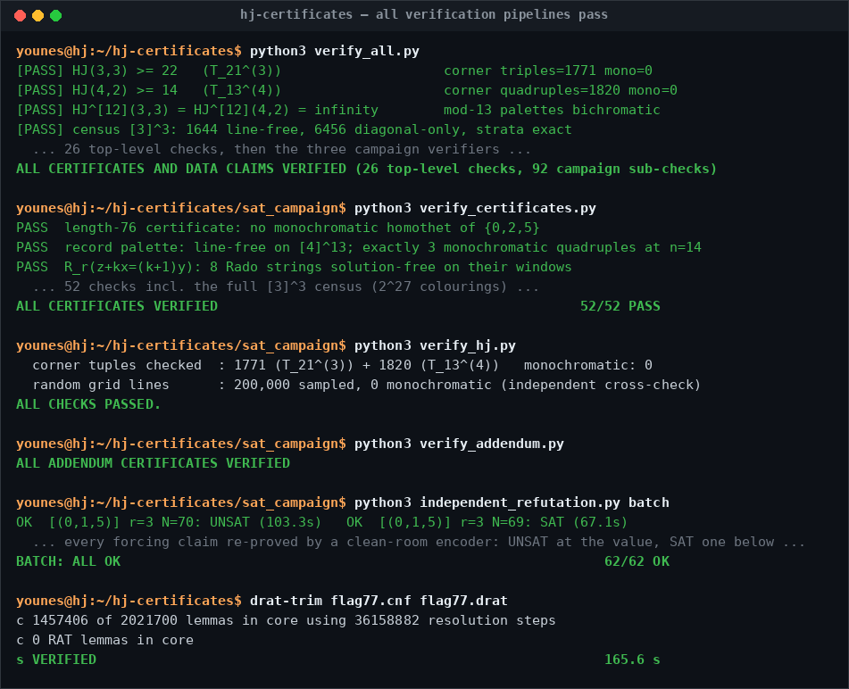

[](https://github.com/ysmouhib/hj-certificates/actions/workflows/verify.yml)
[](https://www.python.org/)
[](LICENSE)
[](https://doi.org/10.5281/zenodo.21537624)

# Hales–Jewett lower-bound certificates and SAT encoders

Code and machine-checkable certificates accompanying the MSc thesis

> Y. Mouhib, *Improving Bounds on Hales–Jewett Numbers: Symmetric Colorings,
> SAT Solvers, Line-Family Variants, and Forcing Structures*, ETH Zürich, 2026
> (advisor: Prof. Dr. L. Halbeisen).

Every lower bound in the thesis marked *computer-assisted* is backed by an
explicit avoidance certificate. Each certificate is a complete proof: its
validity is a finite check against the definitions, carried out here by
standalone verifiers that use the Python standard library only and depend on
no SAT solver. Forcing (unsatisfiability) claims are, by nature, established
with SAT solvers; the encoders are in `src/` and re-confirmation runs are
recorded in `logs/`.

**Companion papers:**
Y. Mouhib, L. Halbeisen, *Improved Lower Bounds for the Hales–Jewett Numbers
via Symmetric Colorings*, [arXiv:2606.22155](https://arxiv.org/abs/2606.22155);
Y. Mouhib, *One-Weight Colorings, the Symmetric Class, and Lower Bounds for
Hales–Jewett Numbers*, [arXiv:2607.02226](https://arxiv.org/abs/2607.02226).
**Interactive companion:** the
[Hales–Jewett Explorer](https://ysmouhib.github.io/hales-jewett-explorer/).

---

## July 2026 update (v2.0) — consolidated article and SAT campaign

The two companion papers above are consolidated and superseded by the
single-author article

> **Y. Mouhib**, *Lower Bounds for the Hales–Jewett Numbers via Symmetric and
> One-Weight Colorings* (2026), appearing as v2 of
> [arXiv:2606.22155](https://arxiv.org/abs/2606.22155).

This release adds the article's full SAT-computation program as the
self-contained directory **`sat_campaign/`**:

| File(s) | Role |
|---|---|
| `gallai_rado_sat.py` | The SAT engine of Section 5.3: encoder, first-occurrence symmetry breaking, stochastic local search, six-solver portfolio, run database. |
| `results.json` | The run database: status, solver, wall time and coloring for every settled instance. |
| `gallai_*_avoid_*.txt`, `rado_*_avoid_*.txt` | 45 machine-readable avoidance certificates (with `manifest.json` index; seven superseded intermediates are retained and annotated). |
| `verify_certificates.py` | Re-verifies every certificate displayed in the article, incl. all Appendix-D SAT certificates and the full [3]^3 census — 52 checks (census block takes a few minutes). |
| `verify_hj.py` | Byte-for-byte verifier for the two simplex tables T₂₁ and T₁₃, all corner tuples, plus a random full-grid line sample. |
| `verify_addendum.py` | Re-verifies every coloring recorded in `results.json`. |
| `independent_refutation.py` | Clean-room re-refutation: a 30-line encoder written from the definitions re-proves every forcing claim (UNSAT at the value, SAT one below) with an independent backend — `batch` mode ends `BATCH: ALL OK`. |
| `export_certificates.py` | Regenerates the certificate files from `results.json`. |
| `ADDENDUM.md` | Chronicle of the campaign (superseded by Section 5.3 and Appendices D–E of the article). |

Twenty-eight new exact values: eighteen two-color Gallai numbers of four-point
sets (up to G₂({0,1,6,7}) = G₂({0,3,4,7}) = 79), G₃({0,1,5}) = 70, the flagship
**G₃({0,2,5}) = 77** (hence HJ(3,3) ≥ 16 by one line), and eight Rado numbers
R_r(z+kx=(k+1)y) for 2 ≤ k ≤ 5, r ∈ {2,3}; plus the lower bounds
R₄(z+2x=3y) ≥ 59 and G₄({0,1,3}) ≥ 94.

**DRAT-validated flagship refutation.** `logs/drat_flagship/` contains a
machine-checkable proof of unsatisfiability for the flagship instance
(N = 77, 231 variables, 2204 clauses): CaDiCaL emitted a 119 MB DRAT proof
(2,021,700 lemmas, no RAT steps — a pure reverse-unit-propagation proof),
validated by `drat-trim` (`s VERIFIED`, 165.6 s; 1,457,406 lemmas in the
trimmed core). The proof ships xz-compressed with its SHA-256 hash and the
checker log; `drat_flagship.sh` reproduces the entire pipeline from a bare
machine. The proof certifies the symmetry-broken CNF; see the article's
satisfiability-preservation remark (or rerun on the unbroken encoding,
`drat_flagship.sh` documents both).



`verify_all.py` also drives the three campaign verifiers and reports a grand
total (top-level checks + campaign sub-checks). It remains standard library
only; allow ~10 minutes for the two census blocks.

## Quick start

```
python3 verify_all.py
```

This reproduces every avoidance certificate and every finite data claim in the
repository by direct enumeration — 26 top-level checks, then the three
campaign verifiers in `sat_campaign/` (each printing its own sub-check count)
— and ends with a self-reported grand total. For each check the script prints
the number of forbidden patterns checked and the number found monochromatic
(which must be zero). No dependencies are needed.


## Repository layout

```
verify_all.py         master direct-enumeration verifier (stdlib only)
certificates/         the certificates themselves, plain text
data/                 large certificates (JSON), censuses, tables, forcing families
logs/                 SAT re-confirmation runs for every forcing claim
sat_campaign/         the article's SAT program: engine, database, 45 certificates
src/                  SAT encoders, search drivers, and reusable verifiers
requirements.txt      dependencies for the SAT encoders only
```

## Certificates

Windows/palettes list `chi(0), chi(1), ...`; simplex files (`.cert`) list one
type per line as `a b c ... colour`; grid files list `x1 x2 x3 x4 colour`.
Provenance: **[O]** original to the first release, **[T]** extracted from the
thesis appendix, **[R]** regenerated by SAT during the July 2026 rebuild (any
valid witness proves the bound; the thesis originals can be substituted at any
time).

| File | Proves | Object |
| --- | --- | --- |
| `hj33_ge22_T21.cert` [O] | HJ(3,3) ≥ 22 | 3-colouring of T₂₁⁽³⁾, no monochromatic corner triple |
| `hj42_ge14_T13.cert` [O] | HJ(4,2) ≥ 14 | 2-colouring of T₁₃⁽⁴⁾, no monochromatic corner quadruple |
| `hj42_palette26.txt` [T] | HJ(4,2) ≥ 14, sharp | period-26 palette, ω=(0,2,3,5); equals the T₁₃ table; 3 mono corners at n=14; anatomy of Prop 5.3 |
| `hj33_interval76.txt` [O] | G₃({0,2,5}) ≥ 77 ⇒ HJ(3,3) ≥ 16 | window of 76, no monochromatic {0,2,5}-homothet |
| `hj33_periodic49.txt` [O] | HJ(3,3) ≥ 15 | 49-periodic palette, ω=(0,1,4), line-free on [3]¹⁴ |
| `gallai_013_r3_window41.txt` [R] | G₃({0,1,3}) = 42 | window of 41 (forcing at 42: `logs/`) |
| `gallai_014_r3_window56.txt` [R] | G₃({0,1,4}) = 57 | window of 56 (forcing at 57: `logs/`) |
| `gallai_0235_r2_window66.txt` [R] | G₂({0,2,3,5}) = 67 | window of 66; input to the HJ(4,2) closed form |
| `gallai_0156_r2_window79.txt` [R] | G₂({0,1,5,6}) = 80 | window of 79 |
| `gallai_D_le9_r2/` (14 files) [R] | Prop 2.21 | all primitive three-point classes of diameter ≤ 9; values match the Brown–Landman–Mishna / Kim–Rho formula, incl. the exceptional 20 and 36 |
| `gallai_013_window93.txt` [O] | G₄({0,1,3}) ≥ 94 | window of 93, {0,1,3}-homothets only (contains reflected copies — see note) |
| `rado_z2x3y_len56.txt` [O] | R₄(z+2x=3y) ≥ 57 | window of 56, no monochromatic *injective solution* (both patterns {0,1,3} and {0,2,3}); superseded by the 58-cell certificate in `sat_campaign/` (R₄ ≥ 59) |
| `ksum33_period12.txt` [O] | κ_sum(3,3) = 11 | 12-periodic palette, no monochromatic 3-AP of gap ≤ 11 (forcing at length 27: `logs/`) |
| `ksum43_period97.txt` [T] | κ_sum(4,3) = 96 | 97-periodic power-residue palette (≡ ind₅ mod 3), no monochromatic 4-AP of gap ≤ 96; ceiling exact |
| `bracket12_33_mod13.txt` [T] | HJ^[12](3,3) = ∞ | 13-periodic palette, ω=(0,5,7); sharp at k=13 |
| `bracket12_42_mod13.txt` [T] | HJ^[12](4,2) = ∞ | 13-periodic palette, ω=(0,2,3,5); sharp at k=13 |
| `hj1_3_witness_n4.txt` [T] | HJ⁽¹⁾(3) ≥ 5 | 2-colouring of [3]⁴, no monochromatic single-interval line (142 lines); = 5 with `logs/hj1_3_le5_forcing` |
| `diagonal_only_n4.txt` [T] | HJ^[3](3) ≥ 5 | 2-colouring of [3]⁴ whose unique monochromatic line is the diagonal |
| `ah34_ge25.txt` [R] | ah(3,4) ≥ 25 | surjective rainbow-free 24-colouring of [3]⁴ (no line with 3 distinct colours); improves Zheng arXiv:2410.12192; ah(3,4) ∈ [25,27] |
| `unit_42_n4.txt` [R] | HJunit(4,2) ≥ 5 | 2-colouring of Z₄⁴, no monochromatic unit line (960 lines) |
| `unit_52_n5.txt` [R] | HJunit(5,2) ≥ 6 | 2-colouring of Z₅⁵, no monochromatic unit line (19 375 lines) |

Note on the two {0,1,3}-related certificates: `gallai_013_window93.txt` avoids
{0,1,3}-homothets **only** and does contain monochromatic reflected copies
b + k·{0,2,3}; the Rado bound rests on the stronger certificates in
`sat_campaign/` (`rado_4_z2x3y_avoid_58.txt`, and the annotated superseded
`..._avoid_57.txt`), which are free of both orientation classes at once —
every injective solution of z + 2x = 3y. One-sided homothety avoidance and
solution-freeness are genuinely different thresholds; the certificates exhibit
the difference explicitly.

## Data

| File | Content |
| --- | --- |
| `hj33_ge22_T21.json`, `hj42_ge14_T13.json` [O] | the two record certificates in JSON |
| `census_3cube_linefree.json` | all 1644 line-free 2-colourings of [3]³ with stabilizer strata (Table A.5: 36/504/24/1080, 396 orbits, 16 sum-type) |
| `census_3cube_diagonly.json` | all 6456 diagonal-only 2-colourings of [3]³ (Table A.6: 34/1338/8/5076, 1330 orbits, 14 sum-type) |
| `anatomy_0235_table.json` | the 26×14 base–scale table of the record palette (Prop 5.3): scales 1–12 bichromatic at every base; k = 13 survivors {0, 13} |
| `cyc_Z3sq_census.json` | Z₃² cyclic census (Prop 7.9): min 2 monochromatic lines, all 66 pairs exact, minimum forcing family = 11 lines |
| `sym_forcing_boundary_7_16.json` | exhaustive forcing boundary on T₄⁽³⁾ (Prop 7.16): exactly four minimal symmetric 2-forcing families of 19 triples |
| `hj1_3_forcing_family.json` [R] | minimal forcing subfamily of L⁽¹⁾([3]⁵): 246 lines on 168 words (thesis run: 262/172; deletion-order dependent, both minimal) |
| `forcing_family_hj32_n4.json` [R] | minimal 2-forcing family of combinatorial lines of [3]⁴: 56 lines on 44 words (thesis run: 67/52) |
| `forcing_family_unit_z33.json` [R] | minimal 2-forcing family of unit lines of Z₃³: 40 lines on 27 points (thesis run: 31/24) |

## Forcing (upper-bound) claims and `logs/`

Avoidance certificates are verified with no solver. Forcing claims — that
*every* colouring of an instance has a monochromatic pattern — are
unsatisfiability statements. `logs/` records one directory per claim with the
instance statistics, a SHA-256 of the CNF where applicable, and UNSAT results
from three pysat backends (CaDiCaL 1.5.3, Glucose 4.2, MiniSat 2.2) from the
July 2026 rebuild: the four Gallai forcings (42, 57, 67, 80), the fourteen
D ≤ 9 classes, κ_sum(3,3) at length 27, the level instance I₍₀,₂,₃,₅₎,₁₄,
HJ⁽¹⁾(3) ≤ 5, HJ(3,2) ≤ 4, HJunit(3,2) ≤ 3, HJgeom(3,2) ≤ 3, plus the MaxSAT
dual (RC2 optimum = 3 monochromatic homothets) and the degree-3 GF(2)
Nullstellensatz independence check. The thesis' original runs used
independent encoders and solvers.

For the SAT campaign of the consolidated article, `sat_campaign/` adds three
further layers: every avoidance coloring is re-verified by enumeration
(`verify_addendum.py`); every forcing claim is re-proved from the definitions
by the clean-room `independent_refutation.py` (UNSAT at the value, SAT one
below, on an independent backend); and the flagship refutation carries a
DRAT proof validated by `drat-trim` (`logs/drat_flagship/`).

## Source

`src/` contains the original encoders (`simplex_encoder.py`,
`verify_certificates.py`, `restricted_lines_sat.py`, `hj1_3_interval.py`,
`diagonal_only_sat.py`, `hj42_oneweight_sat.py`, `hj_pipeline.py` +
`hj_pipeline_driver.py`, `unit_cyclic_sat.py`, `geom_search.py`,
`cert_ksum_4_3.py`) and, new in the rebuild:

- `gallai_sat.py` — search / forcing for one-dimensional Gallai numbers.
- `unit_witness_sat.py` — unit-line witnesses over Z_t^n.
- `level_instance.py` — I₍ω,n₎: counts, degeneracy, MaxSAT dual, degree-3 Nullstellensatz.
- `census_3cube.py` — exhaustive censuses of [3]³ with stabilizer strata.
- `forcing_families.py` — deletion-filter extraction of minimal forcing families.
- `rainbow_sat.py` — the ah(3,4) ≥ 25 search and its verifier.

## Dependencies

The verifiers (`verify_all.py`, everything in `sat_campaign/` except the
engine's solver portfolio, and `src/verify_certificates.py`) need only
Python ≥ 3.8. The SAT drivers need `pip install -r requirements.txt`.

## License

MIT, see `LICENSE`. If you use this material, please cite the article and the
thesis (`CITATION.cff`).
