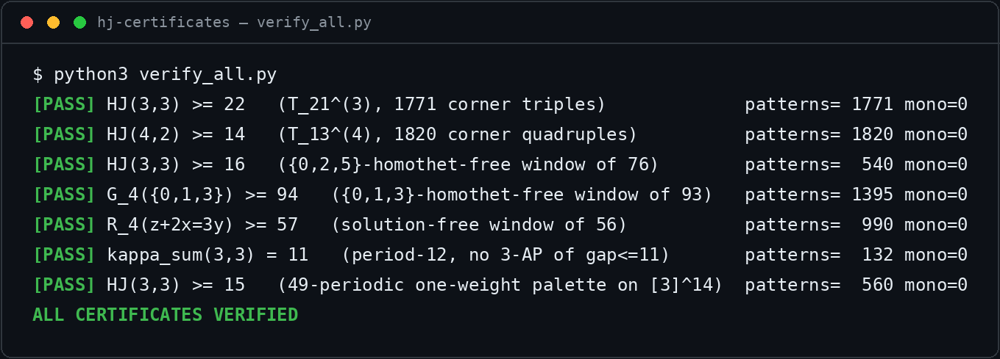

[](https://github.com/ysmouhib/hj-certificates/actions/workflows/verify.yml)
[](https://www.python.org/)
[](LICENSE)

> Code and certificates from the 2025–26 MSc thesis work; consolidated and
> published in July 2026.

> **New records:** HJ(3,3) ≥ 22 (previous best 14) and HJ(4,2) ≥ 14 (previous 12),
> each backed by an explicit certificate that re-verifies from scratch in seconds.



## Papers

Two arXiv preprints extract and consolidate the record bounds proved here:

- Y. Mouhib and L. Halbeisen, *Improved Lower Bounds for the Hales–Jewett Numbers
  via Symmetric Colorings*, arXiv:2606.22155 [math.CO], 2026 —
  https://arxiv.org/abs/2606.22155
  Establishes HJ(3,3) ≥ 22 and HJ(4,2) ≥ 14; certificates `hj33_ge22_T21.cert`
  and `hj42_ge14_T13.cert`.
- Y. Mouhib, *One-Weight Colorings, the Symmetric Class, and Lower Bounds for
  Hales–Jewett Numbers* (single-author), arXiv:2607.02226 [math.CO], 2026 —
  https://arxiv.org/abs/2607.02226


# Hales–Jewett lower-bound certificates and SAT encoders

Code and machine-checkable certificates accompanying the MSc thesis

> Y. Mouhib, *Improving Lower Bounds on Hales–Jewett Numbers: Symmetric
> Colorings, SAT Solvers, Line-Family Variants, and Forcing Structures*,
> ETH Zürich, 2026 (advisor: Prof. Dr. L. Halbeisen).

Every lower bound in the thesis marked *computer-assisted* is backed by an
explicit avoidance certificate. Each certificate is a complete proof: its
validity is a finite check against the definitions, carried out here by
standalone verifiers that use the Python standard library only and depend on
no SAT solver. Forcing (unsatisfiability) claims are, by nature, established
with SAT solvers; the encoders that produce those instances are included.

## Quick start

```bash
python3 verify_all.py
```

This reproduces every avoidance certificate in `certificates/` by direct
enumeration and prints, for each, the number of forbidden patterns checked and
the number found monochromatic (which must be zero). No dependencies are
needed. Expected output:

```
[PASS] HJ(3,3) >= 22   (T_21^(3), 1771 corner triples)             patterns= 1771 mono=0
[PASS] HJ(4,2) >= 14   (T_13^(4), 1820 corner quadruples)          patterns= 1820 mono=0
[PASS] HJ(3,3) >= 16   ({0,2,5}-homothet-free window of 76)        patterns=  540 mono=0
[PASS] G_4({0,1,3}) >= 94   ({0,1,3}-homothet-free window of 93)   patterns= 1395 mono=0
[PASS] R_4(z+2x=3y) >= 57   (solution-free window of 56)           patterns=  990 mono=0
[PASS] kappa_sum(3,3) = 11   (period-12, no 3-AP of gap<=11)       patterns=  132 mono=0
[PASS] HJ(3,3) >= 15   (49-periodic one-weight palette on [3]^14)  patterns=  560 mono=0
ALL CERTIFICATES VERIFIED
```

## Repository layout

```
verify_all.py         master direct-enumeration verifier (stdlib only)
certificates/         the certificates themselves, plain text
data/                 the two largest certificates in JSON
src/                  SAT encoders and the generalized verifier
requirements.txt      dependencies for the SAT encoders only
```

## Certificates

Each file lists a colouring and states the bound it proves. Windows list
`chi(0), chi(1), ...`; simplex files (`.cert`) list one type per line as
`a b c ... colour`.

| File | Proves | Object |
|------|--------|--------|
| `hj33_ge22_T21.cert`      | HJ(3,3) ≥ 22 | 3-colouring of T₂₁⁽³⁾, no monochromatic corner triple (1 ≤ k ≤ 21) |
| `hj42_ge14_T13.cert`      | HJ(4,2) ≥ 14 | 2-colouring of T₁₃⁽⁴⁾, no monochromatic corner quadruple |
| `hj33_interval76.txt`     | HJ(3,3) ≥ 16 | window of 76, no monochromatic {0,2,5}-homothet; G₃({0,2,5}) ≥ 77 |
| `hj33_periodic49.txt`     | HJ(3,3) ≥ 15 | 49-periodic one-weight palette, ω = (0,1,4), line-free on [3]¹⁴ |
| `gallai_013_window93.txt` | G₄({0,1,3}) ≥ 94 | window of 93, no monochromatic {0,1,3}-homothet |
| `rado_z2x3y_len56.txt`    | R₄(z+2x=3y) ≥ 57 | window of 56, no monochromatic injective solution of z + 2x = 3y |
| `ksum33_period12.txt`     | κ_sum(3,3) = 11 | 12-periodic palette, no monochromatic 3-AP of gap ≤ 11 |

The 253-cell witness for HJ(3,3) ≥ 22 is the one certificate too large to
print in full in the thesis; it is `hj33_ge22_T21.cert` here.

Note that `gallai_013_window93.txt` avoids {0,1,3}-homothets but is *not*
solution-free for z + 2x = 3y: the equation's injective solutions also include
the reflected copies b + k·{0,2,3}, of which this colouring contains
monochromatic instances. The Rado bound rests on the separate, stronger
`rado_z2x3y_len56.txt`.

## Source

`src/` contains the encoders that generate the SAT instances and two
verifiers:

- `simplex_encoder.py` — symmetric (one-weight) instances on the type simplex,
  valid for all (t, r, K); the reduction that makes the record searches
  tractable.
- `verify_certificates.py` — standalone verifier for a single simplex
  certificate: `python3 src/verify_certificates.py t n r K file`.
- `restricted_lines_sat.py` — full-grid encoder for the bracket L^[K] and
  interval L^(q) line families.
- `hj1_3_interval.py` — the HJ⁽¹⁾(3) = 5 computation: verifies the [3]⁴ witness,
  proves [3]⁵ unsatisfiable, and extracts the minimal forcing subfamily.
- `diagonal_only_sat.py` — search for a colouring whose only monochromatic line
  is the diagonal.
- `hj42_oneweight_sat.py` — one-weight palette search for the HJ(4,2) ceiling.
- `hj_pipeline.py`, `hj_pipeline_driver.py` — block-symmetric encoder with
  warm-starting, star-degree cube-and-conquer, and a solver-independent
  verifier.
- `unit_cyclic_sat.py` — unit-line instances over Z_t^n.
- `geom_search.py` — exhaustive decision of HJ^geom(3,2).
- `cert_ksum_4_3.py` — self-contained certificate for κ_sum(4,3) = 96.

## Dependencies

The verifiers (`verify_all.py`, `src/verify_certificates.py`, and the verifier
inside `hj_pipeline.py`) need only Python ≥ 3.8. The SAT encoders need the
solvers in `requirements.txt`:

```bash
pip install -r requirements.txt
```

## Reproducing the forcing (upper-bound) claims

Avoidance certificates are verified above with no solver. Forcing claims —
that *every* colouring of a given instance has a monochromatic line — are
unsatisfiability statements and require a SAT solver. Run the relevant encoder
in `src/`; the thesis reports, for each such claim, the number of independent
solvers used to confirm it.

## License

MIT, see `LICENSE`. If you use this material, please cite the thesis
(`CITATION.cff`).
